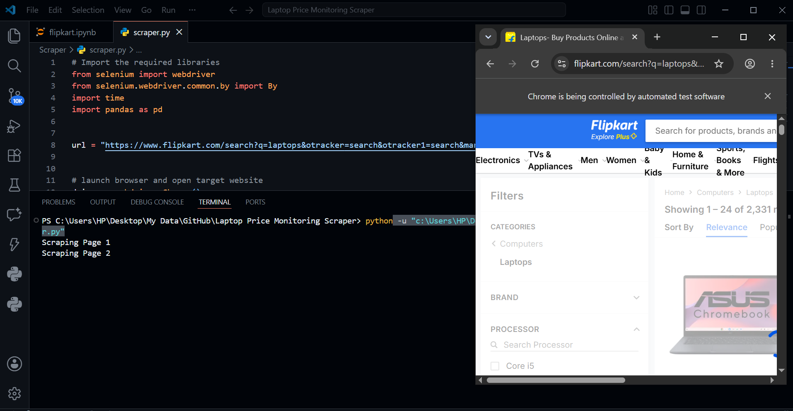
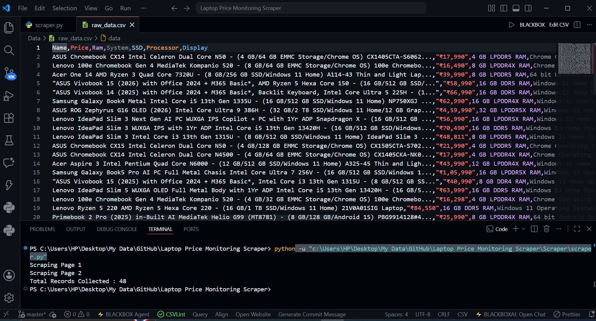

# 💻 Automated Laptop Price Monitoring & Web Scraping System

## 📌 Project Overview

The **Automated Laptop Price Monitoring & Web Scraping System** is an end-to-end data collection and analysis project designed to automatically scrape laptop listings from Flipkart, clean and transform the collected data, and generate structured datasets for further analysis.

The project demonstrates practical skills in:

* Web Scraping with Selenium
* Data Collection Automation
* Data Cleaning & Transformation
* Exploratory Data Analysis (EDA)
* Data Preparation for Business Intelligence and Reporting

The system automatically extracts laptop specifications such as brand, processor, RAM, SSD capacity, operating system, display size, and price, then transforms the raw dataset into a clean and analysis-ready format.

---

## 🎯 Objectives

* Automate laptop data collection from e-commerce websites.
* Extract product specifications and pricing information.
* Clean inconsistent and unstructured product data.
* Create a structured dataset suitable for analysis.
* Analyze laptop pricing trends based on specifications.

---

## 🛠️ Tools & Technologies

| Category                | Tools            |
| ----------------------- | ---------------- |
| Programming Language    | Python           |
| Web Scraping            | Selenium         |
| Data Manipulation       | Pandas           |
| Numerical Computing     | NumPy            |
| Development Environment | Jupyter Notebook |
| Version Control         | Git & GitHub     |

---

## 📂 Project Structure

```text
laptop-price-monitoring-scraper/
│
├── Data/
│   ├── raw_data.csv
│   └── cleaned_data.csv
│
├── Scraper/
│   └── scraper.py
│
├── Notebook/
│   └── cleaning_analysis.ipynb
│
├── Screenshots/
│   ├── scraper_running.png
│   └── dataset_preview.png
│
├── requirements.txt
├── README.md
├── .gitignore
```

---

## 🔍 Data Collection Process

The scraper performs the following tasks:

1. Launches a Chrome browser using Selenium.
2. Navigates to Flipkart's laptop listings page.
3. Extracts:

   * Laptop Name
   * Price
   * RAM
   * SSD Capacity
   * Processor
   * Operating System
   * Display Size
4. Handles missing specifications gracefully.
5. Navigates through multiple pages automatically.
6. Stores collected data into a raw CSV dataset.

### Raw Dataset Example

| Name                 | Price   | RAM  | SSD    |
| -------------------- | ------- | ---- | ------ |
| ASUS Chromebook CX14 | ₹17,990 | 4 GB | N/A    |
| Acer One 14 Ryzen 3  | ₹39,990 | 8 GB | 256 GB |

---

## 🧹 Data Cleaning & Transformation

The raw scraped data contained inconsistencies and unnecessary text. The following cleaning steps were performed:

### Data Cleaning Tasks

* Removed duplicate records
* Removed missing values
* Extracted Brand and Model information
* Cleaned Price column by removing:

  * Currency symbols (₹)
  * Thousand separators (,)
* Standardized RAM values
* Standardized SSD values
* Simplified Processor names
* Simplified Display measurements
* Created a structured and analysis-ready dataset

### Cleaned Dataset Example

| Brand   | Model    | Processor  | RAM   | SSD    | Price |
| ------- | -------- | ---------- | ----- | ------ | ----- |
| Samsung | Galaxy   | Intel Core | 16 GB | 512 GB | 62990 |
| Acer    | One      | AMD Ryzen  | 8 GB  | 256 GB | 39990 |
| ASUS    | Vivobook | Intel Core | 16 GB | 512 GB | 66990 |

---

## 📊 Exploratory Data Analysis

The cleaned dataset was analyzed to identify pricing patterns across different laptop specifications. The following analyses were performed:

* Brand-wise maximum price comparison
* Processor-wise maximum price comparison
* RAM capacity vs laptop price analysis
* SSD storage capacity vs laptop price analysis
* Display size vs laptop price analysis
* Identification of premium and budget laptop configurations

The cleaned dataset can also be used for:

* Market research
* Price monitoring
* Competitor analysis
* Business intelligence dashboards
* Machine learning projects

---

## 📸 Project Screenshots

### Scraper Execution



### Dataset Preview



---

## 📈 Key Outcomes

* Automated extraction of laptop product information.
* Built a reusable web scraping pipeline.
* Converted unstructured product data into a clean analytical dataset.
* Demonstrated practical data engineering and data analysis skills.
* Created a dataset suitable for reporting and business insights.

---

## 🚀 How to Run the Project

### 1. Clone the Repository

```bash
git clone https://github.com/MuhammSalman/Laptop-Price-Monitoring-Scraper.git
```

### 2. Navigate to Project Directory

```bash
cd laptop-price-monitoring-scraper
```

### 3. Create Virtual Environment

```bash
python -m venv venv
```

### 4. Activate Virtual Environment

#### Windows

```bash
venv\Scripts\activate
```

#### Mac/Linux

```bash
source venv/bin/activate
```

### 5. Install Dependencies

```bash
pip install -r requirements.txt
```

### 6. Run Scraper

```bash
python Scraper/scraper.py
```

### 7. Open Notebook

```bash
jupyter notebook
```

Open:

```text
Notebook/cleaning_analysis.ipynb
```

---

## 📋 Requirements

Main Libraries Used:

```text
selenium
pandas
numpy
```

Install all dependencies using:

```bash
pip install -r requirements.txt
```

---


---

## 👨‍💻 Author

### Muhammad Salman

Data Scientist | Machine Learning Engineer | Data Analytics & Web Scraping 

📧 muhammadsalmanshamir@gmail.com

🔗 https://www.linkedin.com/in/muhammad-salman-5b4926368

📂 https://github.com/MuhammSalman

---

⭐ If you found this project useful, consider giving it a star.
